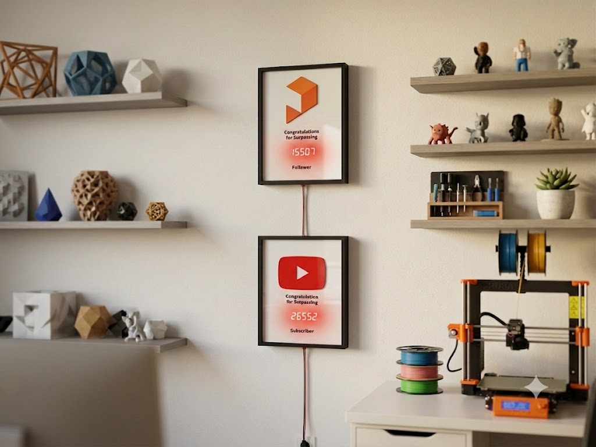
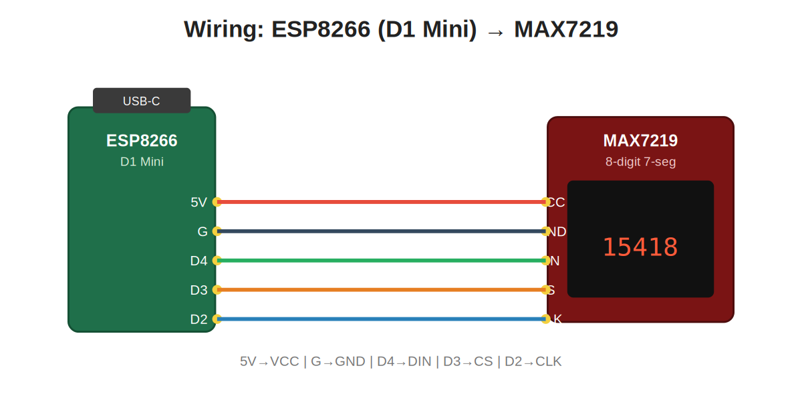
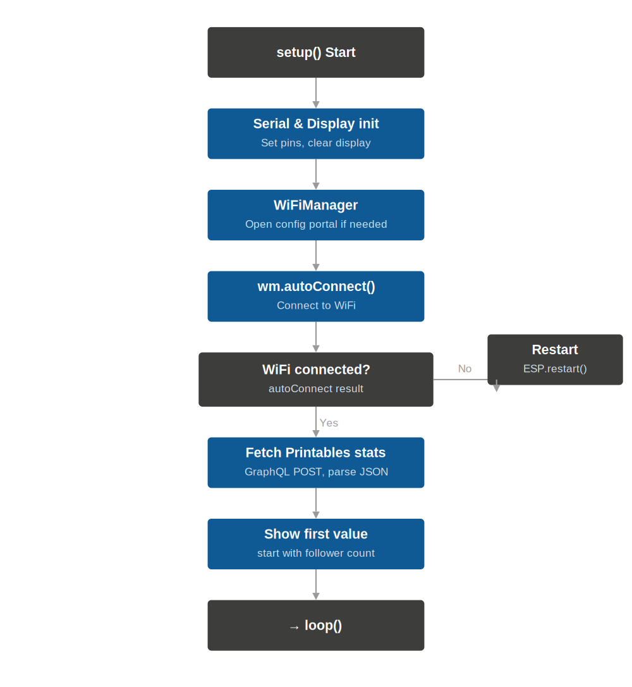
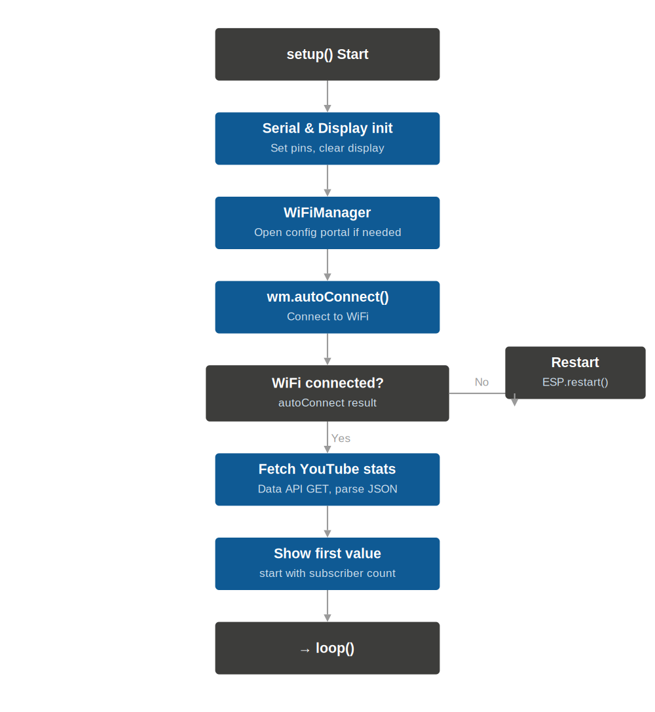

# Trophy Counter — YouTube + Printables

A wall-mounted award frame, styled like a YouTube Play Button trophy, that shows
your **live creator stats** on a MAX7219 7-segment display. Build one for YouTube
(subscribers / views) and one for Printables (followers / downloads) and hang them
side by side.

The number is not printed on paper — it glows through the cover sheet from a real
display and updates itself over WiFi.



## How it works

An ESP8266 (Wemos D1 Mini) connects to your WiFi, pulls the current numbers from an
API, and drives an 8-digit MAX7219 7-segment display. The display alternates between
two values every 5 minutes.

| Version    | Source                     | Values shown              |
| ---------- | -------------------------- | ------------------------- |
| YouTube    | YouTube Data API v3        | subscribers / views       |
| Printables | Printables GraphQL API     | followers / downloads     |

## Repository layout

```
firmware/
  PrintablesCounter/   Arduino sketch for the Printables version
  YouTubeCounter/      Arduino sketch for the YouTube version
hardware/
  3d-models/           printable parts (.3mf): frame, back panel, two fronts
docs/
  images/              wiring diagram and program flow charts
  printables-listing.pdf   the original Printables model description
```

## Hardware

- ESP8266 (Wemos D1 Mini)
- MAX7219 8-digit 7-segment display
- A picture frame, or print the included frame parts
- 5 short jumper wires, a USB cable for power

### Wiring

| MAX7219 | ESP8266 |
| ------- | ------- |
| VCC     | 5V      |
| GND     | G       |
| DIN     | D4      |
| CS      | D3      |
| CLK     | D2      |



### 3D-printed parts

The parts in `hardware/3d-models/` are shared between both versions — only the front
panel changes:

- `frame.3mf` — main frame
- `backpanel.3mf` — back panel (friction fit)
- `front-printables.3mf` — front with the Printables logo
- `front-youtube.3mf` — front with the YouTube play button

Print the base/back in a solid opaque color so the display light only shines through
the number window and not through the whole surface. A sheet of plain paper between
the front and back panel diffuses the light and hides the dark segments of the display.

## Firmware

### Libraries

Install these through the Arduino Library Manager:

- ESP8266WiFi (comes with the ESP8266 board package)
- WiFiManager
- ESP8266HTTPClient
- WiFiClientSecure
- ArduinoJson
- LedControl

### Setup

1. Open the sketch for the version you want (`firmware/PrintablesCounter` or
   `firmware/YouTubeCounter`) in the Arduino IDE. Keep the `.ino` inside its folder —
   the IDE expects the sketch folder and file to share a name.
2. Select the Wemos D1 Mini board and the correct port.
3. Fill in your own settings (see below), then upload.
4. On first boot the board opens a WiFi hotspot ("Printables-Counter" /
   "YouTube-Counter"). Connect to it with a phone or laptop and enter your WiFi
   credentials — this is handled by WiFiManager, so no credentials are stored in the code.

**Printables:** set your profile handle (without the `@`):

```cpp
const char* USER_HANDLE = "YourHandle";
```

**YouTube:** set your own API key and channel ID:

```cpp
const char* API_KEY    = "YOUR_API_KEY";
const char* CHANNEL_ID = "YOUR_CHANNEL_ID";
```

Create the API key in the [Google Cloud Console](https://console.cloud.google.com/)
and enable the **YouTube Data API v3**. The channel ID is the `UC...` string from your
channel URL. **Do not commit your real API key** — keep the placeholder in any version
you publish.

### Program flow

| Printables | YouTube |
| ---------- | ------- |
|  |  |

## Notes on the Printables API

Printables has no official public stats API. The website talks to a GraphQL endpoint
at `https://api.printables.com/graphql/`. The sketch sends a small POST query for the
public profile fields `followersCount` and `downloadCount`. Because this is an
unofficial endpoint it may change without notice; the query interval is kept low
(once every 2 hours) to stay light on the API.

## License

Released under the MIT License — see [LICENSE](LICENSE).

The YouTube and Printables logos and names are trademarks of their respective owners
and are not covered by this license. The 3D models reproduce those logos for personal,
non-commercial use.
